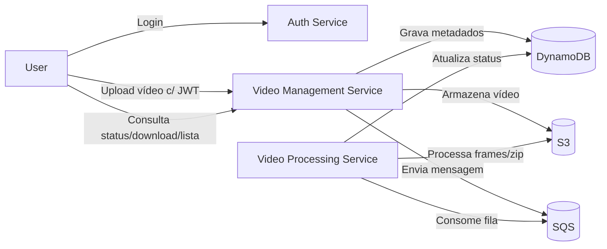

# Video Management Service (FIAP SOAT)

Microsserviço responsável por **gerenciar o ciclo de vida de vídeos**: upload para S3, consulta de status (DynamoDB), **listagem dos vídeos do usuário** e geração do link de download do arquivo **processado** (pré-assinado).

> **Autenticação fora deste serviço**
> A autenticação/JWT é responsabilidade de um **Auth Service** separado. Aqui nós apenas **validamos** o token recebido (via chamada ao Auth) para garantir acesso aos recursos do próprio usuário.

---

## Status e Qualidade do Código

### CI/CD

[](https://github.com/FIAP-Tech-Challenge-SOAT-10/video-upload-service-hackaton/actions/workflows/sonar.yml)

### SonarCloud

[](https://sonarcloud.io/summary/new_code?id=FIAP-Tech-Challenge-SOAT-10_video-upload-service-hackaton)
[](https://sonarcloud.io/summary/new_code?id=FIAP-Tech-Challenge-SOAT-10_video-upload-service-hackaton)
[](https://sonarcloud.io/summary/new_code?id=FIAP-Tech-Challenge-SOAT-10_video-upload-service-hackaton)
[](https://sonarcloud.io/summary/new_code?id=FIAP-Tech-Challenge-SOAT-10_video-upload-service-hackaton)
[](https://sonarcloud.io/summary/new_code?id=FIAP-Tech-Challenge-SOAT-10_video-upload-service-hackaton)
[](https://sonarcloud.io/summary/new_code?id=FIAP-Tech-Challenge-SOAT-10_video-upload-service-hackaton)
[](https://sonarcloud.io/summary/new_code?id=FIAP-Tech-Challenge-SOAT-10_video-upload-service-hackaton)

---

## Sumário

* [Arquitetura](#arquitetura)
* [Endpoints](#endpoints)
* [Modelo de Dados](#modelo-de-dados)
* [Como rodar (local / Docker)](#como-rodar-local--docker)
* [Variáveis de ambiente](#variáveis-de-ambiente)
* [Observabilidade](#observabilidade)
* [Qualidade (Testes, Cobertura e Sonar)](#qualidade-testes-cobertura-e-sonar)
* [Segurança (S3 ExpectedBucketOwner)](#segurança-s3-expectedbucketowner)
* [Roadmap](#roadmap)
* [Licença](#licença)

---

## Arquitetura

### Componentes (MVP)

* **Video Management Service (este repositório / FastAPI)**

  * `POST /videos/upload` → salva o vídeo original no S3 e publica mensagem na SQS
  * `GET /videos/{id_video}` → consulta status no DynamoDB
  * `GET /videos/download/{id_video}` → gera link **pré-assinado** do ZIP processado
  * `GET /videos/user/videos` → **lista todos os vídeos do usuário autenticado** (id extraído do JWT)
  * `GET /health` → verificação de saúde
  * `GET /metrics` → métricas Prometheus
  * **S3**: armazena o vídeo original (upload) e o `.zip` gerado
  * **DynamoDB**: guarda metadados e status
  * **SQS**: fila para o serviço de processamento

* **Auth Service (externo)**: login/registro/JWT (este serviço **valida** o token via Auth `/me`)

* **Video Processing Service (externo)**: consome SQS, processa com `ffmpeg`, grava `.zip` no S3 e atualiza status no DynamoDB.

### Diagrama



---

## Endpoints

> Todos exigem **Authorization: Bearer <token>** (validado externamente).

### `POST /videos/upload` (multipart/form-data)

Campos:

* `file`: arquivo (`video/mp4` ou `video/quicktime`)
* `titulo`: string
* `autor`: string

**Resposta 202**

```json
{
  "id_video": "abc123",
  "titulo": "Meu vídeo",
  "autor": "Iana",
  "status": "UPLOADED",
  "s3_key": "uploads/2025/09/abc123.mp4"
}
```

**Erros**: `413` (arquivo excede limite), `415` (MIME não suportado), `502` (falha no S3), `500` (falha ao publicar SQS).

---

### `GET /videos/{id_video}`

**Resposta 200**

```json
{
  "id_video": "abc123",
  "titulo": "Meu vídeo",
  "autor": "Iana",
  "status": "PROCESSING",
  "file_path": "s3://bucket/uploads/abc123.mp4",
  "data_criacao": "2025-09-07T00:00:00",
  "data_upload": "2025-09-07T00:00:00"
}
```

**Erros**: `404` (não encontrado).

---

### `GET /videos/download/{id_video}`

**Resposta 200**

```json
{ "presigned_url": "https://example.s3.amazonaws.com/...signature..." }
```

**Erros**:
`404` (vídeo não encontrado) • `409` (processamento ainda em andamento; ZIP ausente) • `400` (caminho do ZIP inválido)

---

### `GET /videos/user/videos` — **List My Videos**

Lista **todos os vídeos do usuário autenticado**.
O serviço **não** aceita `id` por parâmetro — o identificador do usuário é extraído do **token JWT**.

**Resposta 200**

```json
[
  {
    "id_video": "vid1",
    "titulo": "Video 1",
    "autor": "Author 1",
    "status": "DONE",
    "file_path": "s3://bucket/vid1.mp4",
    "data_criacao": "2025-09-07T00:00:00",
    "data_upload": "2025-09-07T00:00:00",
    "email": "user@example.com",
    "username": "tester",
    "id": "123"
  },
  {
    "id_video": "vid2",
    "titulo": "Video 2",
    "autor": "Author 2",
    "status": "PROCESSING",
    "file_path": "s3://bucket/vid2.mp4",
    "data_criacao": "2025-09-07T00:00:00",
    "data_upload": "2025-09-07T00:00:00",
    "email": "user@example.com",
    "username": "tester",
    "id": "123"
  }
]
```

**Erros**: `401` (token ausente/ inválido).
**Nota**: no MVP, a consulta é feita por **Scan + Filter** (`Attr("id").eq(user_id)`). Em produção, recomenda-se um **GSI** para listar por usuário sem `Scan`.

---

### Observabilidade e Saúde

* `GET /health` → `200 OK`
* `GET /metrics` → métricas em `text/plain; version=0.0.4` (Prometheus)

### Exemplo rápido (cURL)

```bash
# Upload
curl -X POST http://localhost:8000/videos/upload \
  -H "Authorization: Bearer $TOKEN" \
  -F "file=@video.mp4;type=video/mp4" \
  -F "titulo=Meu vídeo" \
  -F "autor=Iana"

# Status
curl -H "Authorization: Bearer $TOKEN" http://localhost:8000/videos/abc123

# Link de download
curl -H "Authorization: Bearer $TOKEN" http://localhost:8000/videos/download/abc123

# Listar meus vídeos
curl -H "Authorization: Bearer $TOKEN" http://localhost:8000/videos/user/videos
```

---

## Modelo de Dados

**Tabela DynamoDB** `videos` (PK: `id_video`)

| Campo          | Tipo   | Descrição                                     |
| -------------- | ------ | --------------------------------------------- |
| `id_video`     | string | Identificador do vídeo (PK)                   |
| `id`           | string | ID do usuário (do token)                      |
| `email`        | string | E-mail do usuário                             |
| `username`     | string | Username do usuário                           |
| `titulo`       | string | Título informado no upload                    |
| `autor`        | string | Autor informado no upload                     |
| `status`       | string | `UPLOADED` | `PROCESSING` | `DONE` | `ERROR`  |
| `file_path`    | string | `s3://bucket/…/original.mp4`                  |
| `zip_path`     | string | `s3://bucket/…/processed.zip` (quando pronto) |
| `data_criacao` | string | ISO datetime                                  |
| `data_upload`  | string | ISO datetime                                  |

> Para **`GET /videos/user/videos`**, usamos `Scan + Filter` por `id` no MVP. Em produção, crie um **GSI** (ex.: `GSI1PK = id`) para leitura eficiente.

---

## Como rodar (local / Docker)

### Requisitos

* Python 3.10+ (para desenvolvimento local)
* Docker + Docker Compose
* (Dev) **LocalStack** para AWS (porta `4566`)

### 1) Subir dependências locais (LocalStack)

```bash
docker compose up -d localstack
# opcional: seed de recursos (tabela, bucket, fila)
bash scripts/init-aws.sh
```

### 2) Ambiente local (uvicorn)

```bash
python -m venv .venv && source .venv/bin/activate
pip install -r requirements.txt

# variáveis para apontar ao LocalStack
export AWS_ENDPOINT_URL=http://localhost:4566
export DYNAMODB_ENDPOINT_URL=http://localhost:4566
export S3_ENDPOINT_URL=http://localhost:4566
export SQS_ENDPOINT_URL=http://localhost:4566
export AWS_ACCESS_KEY_ID=test
export AWS_SECRET_ACCESS_KEY=test
export AWS_DEFAULT_REGION=us-east-1

# variáveis do serviço
export AUTH_BASE_URL=http://localhost:9000   # Auth local (NÃO use http em prod)
export S3_BUCKET=video-service-bucket
export DDB_TABLE=videos
export SQS_QUEUE_URL=http://localhost:4566/000000000000/queue
export MAX_UPLOAD_MB=200

uvicorn app.main:app --reload --port 8000
```

### 3) Docker Compose (serviço)

No `docker-compose.yml`, certifique-se de que o serviço usa os endpoints corretos e depende do `localstack`. Exemplo de envs:

```yaml
environment:
  AWS_ENDPOINT_URL: http://localstack:4566
  DYNAMODB_ENDPOINT_URL: http://localstack:4566
  S3_ENDPOINT_URL: http://localstack:4566
  SQS_ENDPOINT_URL: http://localstack:4566
  AWS_ACCESS_KEY_ID: test
  AWS_SECRET_ACCESS_KEY: test
  AWS_DEFAULT_REGION: us-east-1
  AUTH_BASE_URL: http://auth:8000
  S3_BUCKET: video-service-bucket
  DDB_TABLE: videos
  SQS_QUEUE_URL: http://localstack:4566/000000000000/queue
  MAX_UPLOAD_MB: 200
```

> **Em GitHub Actions**, o `localstack` é acessível pelo **`http://localhost:4566`** a partir do runner. Use essas envs no step de testes.

---

## Variáveis de ambiente

| Variável                | Obrigatória | Default (dev)           | Exemplo/Notas                                   |
| ----------------------- | ----------- | ----------------------- | ----------------------------------------------- |
| `AUTH_BASE_URL`         | ✔️          | —                       | URL do Auth Service (`https://…` em produção)   |
| `AWS_ENDPOINT_URL`      | —           | `http://localhost:4566` | LocalStack (dev). **Não definir** em produção   |
| `DYNAMODB_ENDPOINT_URL` | —           | `http://localhost:4566` | Idem                                            |
| `S3_ENDPOINT_URL`       | —           | `http://localhost:4566` | Idem                                            |
| `SQS_ENDPOINT_URL`      | —           | `http://localhost:4566` | Idem                                            |
| `AWS_ACCESS_KEY_ID`     | ✔️ (dev)    | `test`                  | Credenciais fake para LocalStack                |
| `AWS_SECRET_ACCESS_KEY` | ✔️ (dev)    | `test`                  | Idem                                            |
| `AWS_DEFAULT_REGION`    | ✔️          | `us-east-1`             | Região AWS                                      |
| `S3_BUCKET`             | ✔️          | `video-service-bucket`  | Bucket para uploads/ZIP                         |
| `DDB_TABLE`             | ✔️          | `videos`                | Tabela DynamoDB                                 |
| `SQS_QUEUE_URL`         | ✔️          | —                       | URL da fila (LocalStack ou AWS)                 |
| `MAX_UPLOAD_MB`         | —           | `200`                   | Limite do payload de upload (MB)                |
| `EXPECTED_BUCKET_OWNER` | —           | —                       | ID da conta AWS para checagem de dono do bucket |

> **Produção**: use **HTTPS** para `AUTH_BASE_URL` e endpoints AWS reais (não defina `*_ENDPOINT_URL`).

---

## Observabilidade

* **Logs**: sem vazar tokens — o serviço loga apenas um **token_id seguro** (SHA-1 truncado) para correlação.
* **Métricas**: contador de operações DynamoDB/S3/SQS (`*_OPS.labels(op, status).inc()`), tempos e total de uploads.
* **`/metrics`** compatível com Prometheus + Grafana.

---

## Qualidade (Testes, Cobertura e Sonar)

* Testes com `pytest` (inclui **auth**, **routers** e **repositórios**).
* Cobertura via `pytest-cov` → `coverage.xml` (root).
* SonarCloud integrado no pipeline (`.github/workflows/sonar.yml`).

Comandos úteis:

```bash
pytest -q --maxfail=1 --disable-warnings \
  --cov=app --cov-branch --cov-report=term-missing --cov-report=xml:coverage.xml
```

**Dicas CI**

* Antes de rodar os testes, aguarde o LocalStack:
  `until curl -sf http://localhost:4566/health | jq -e '.services.dynamodb=="running"'; do sleep 2; done`
* Em Actions, use **`localhost:4566`** (não `localstack:4566`) para o runner.
* Garanta `relative_files=True` no `.coveragerc` para caminhos relativos no coverage.

---

## Segurança (S3 ExpectedBucketOwner)

Para evitar **confused deputy** e acessos indevidos entre contas, habilite a checagem do dono do bucket:

* Configure `EXPECTED_BUCKET_OWNER` e passe na chamada S3 (`ExpectedBucketOwner`).
* **Criptografia**: habilite SSE-S3 ou SSE-KMS no bucket.
* **Rede**: use VPC Endpoints para S3/Dynamo/SQS em produção.
* **Auth**: este serviço **não** cria tokens; apenas valida via Auth externo.

---

## Roadmap

* [ ] GSI para `list_by_user` (evitar `Scan + Filter`)
* [ ] Reprocessamento/retry assíncrono
* [ ] Upload multipart (grandes arquivos)
* [ ] Policies IAM mínimas por ambiente
* [ ] Tracing distribuído (OpenTelemetry)

---

## Licença

Este projeto é distribuído sob a licença **MIT**. Consulte o arquivo `LICENSE` para mais detalhes.
